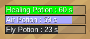

# HUD Timers (`hud_timers`)

A library for easily maintaining HUD timers.

HUD timers are colorful yet subtle bars indicating some time consuming process.

## About

Configuration help can be found under `config_help.md` in the same folder as this.

Depends on [`modlib`](https://github.com/appgurueu/modlib).

**Please note that this mod may not work along well with other mods altering the HUD.**

Code licensed under the MIT License. Written by Lars Mueller alias LMD or appguru(eu).

Media license: files taken or derived from [hudbars](https://repo.or.cz/w/minetest_hudbars.git)

* `textures/hudbars_bar_background.png`: made by Wuzzy, licensed under MIT
* `textures/hud_timers_bar_timeout.png`: made by LMD, but very similar, can be seen as derivative of Wuzzy's work, therefore licensed under MIT as well

All in all, the media is licensed under the MIT license, with credits going to Wuzzy.

## Screenshot



## API

Code should be self-explanatory. If not, feel free to contact me (opening an issue is also fine). Will probably document it here at some point...

## Configuration

### Locations

* JSON Configuration: `<worldpath>/config/hud_timers.json`
* Text Logs: `<worldpath>/logs/hud_timers/<date>.txt`
* Readme: `<modpath/gamepath>/hud_timers/Readme.md`

### Default Configuration

Located under `<modpath/gamepath>/hud_timers/default_config.json`

```json
{
  "hud_pos": {"x": 0,"y": 0},
  "globalstep": 0.1,
  "hud_timers_max": 10,
  "format": "%s: %s s"
}
```

### Usage

#### `hud_pos`

Screen coordinates where the timer stack should start.

#### `globalstep`

How often timers should be updated(interval, seconds).

#### `hud_timers_max`

How many timers(maximum) may exist at a time.

#### `format` : "%s : %s s"

The format for the timer label - first string is timer name, second one is seconds left.