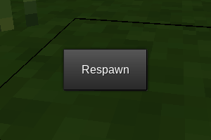

# Respawn Timer (`respawn_timer`)

Forces players to wait a set duration before respawning.

## About

Depends on [`modlib`](https://github.com/appgurueu/modlib) and [`hud_timers`](https://github.com/appgurueu/hud_timers). Licensed under the MIT License. Written by Lars Mueller aka LMD or appguru(eu).

## Screenshot

## Links

* [GitHub](https://github.com/appgurueu/respawn_timer) - sources, issue tracking, contributing
* [Discord](https://discordapp.com/invite/ysP74by) - discussion, chatting
* [Minetest Forum](https://forum.minetest.net/viewtopic.php?f=9&t=25749) - (more organized) discussion
* [ContentDB](https://content.minetest.net/packages/LMD/respawn_timer) - releases (cloning from GitHub is recommended)

## Features

* Player is actually dead while dead (`player:get_hp() == 0`). This minimizes breakage of other mods.
* Custom respawn formspec (simple button).
* Enhanced security: Actions of dead players (chatting, inventory, ...) are forbidden.
* Basic persistence: Rejoining will only reset the timer.

## API

Relies on multiple hacks and thus imposes the following limitations on other mods:

* No manual modification of the `minetest.registered_on_dieplayers` table `on_mods_loaded`
* No insertion at index 1 of the `minetest.registered_on_chat_messages` table `on_mods_loaded`
  * Mods doing this have to be listed as optional dependencies
* Mods using bone position overrides on nonstandard bones have to use the API for those to be preserved properly
  * Standard bone names are `"Head"`, `"Body"`, `"Arm_Right"`, `"Arm_Left"`, `"Leg_Right"`, `"Leg_Left"`
  * `respawn_timer.bone_names_by_model["<filename>.<ext>"] = { "Bone_1", "Bone_2", ... }` including standard bone names if used
  * If both bone position and rotation are set to `{ x = 0, y = 0, z = 0 }`, the bone will be ignored

Respawning can be done using `respawn_timer.respawn(player_ref)`.

## Configuration

<!--modlib:conf:2-->
### `timer`

#### `color`

Timer fill color as hex string

* Type: string
* Default: `FF00FF`
* &gt;= 000000
* &lt;= FFFFFF

#### `duration`

Timer duration in seconds

* Type: number
* Default: `5`
* &gt;= 0
* &lt;= 6000

#### `name`

Timer caption

* Type: string
* Default: `Respawn`

<!--modlib:conf-->